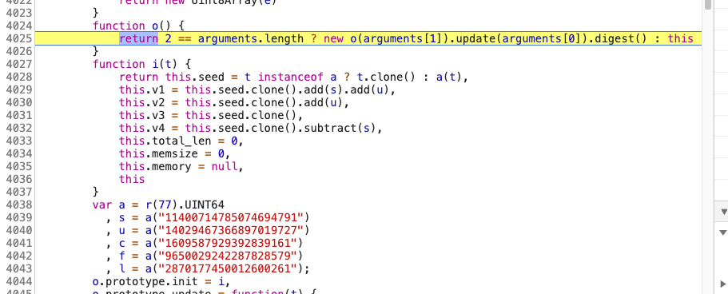
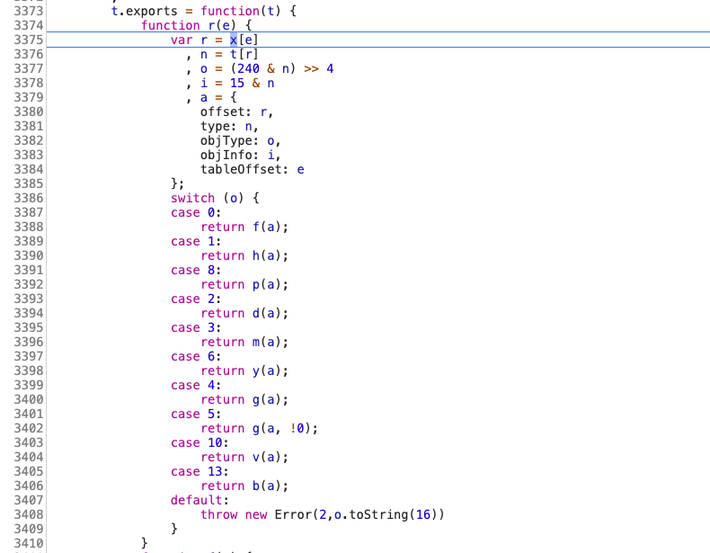

# -python-

window.__data__参数破解：💗base64 + xxHash + bplist💗

## base64 编码


13992 行，e.from(r, "base64") 很明显的提示 --> base解码过程

我们使用Python库 base64 进行验证
```python
import base64
base64.b64decode(window.__data__)
```

## xxHash
13996 行，Object(o.hash)  --> 肯定是一个hash 算法。我们下一步进入这个函数。

4025 行 update().digest() --> 用过Python hashlib库的人是不是感觉很熟悉

4039 - 4043 行 五个 magic constants   --> 进一步确认是xxhash 算法

```python
import xxhash
# u 是base64 解密之后的最后16个字节
sec_key = xxhash.xxh64_hexdigest(u, 41405).encode("utf-8")
```


xxHash 是一种非常快速的非加密哈希算法。使用[教程](https://pypi.org/project/xxhash/)

## bplist: Binary Plist解析详解
我们继续向下执行代码，这里初步怀疑是bplist 解析过程（为什么我会知道，后面会介绍[bplist](#bplist)的知识）


我们继续调试



看到这。不用怀疑这就是pblist解析过程。


<span id = "bplist">下面介绍bplist知识。</span>

### Handle trailer, last 32 bytes of the file (文件最后32个字节)            
                                                          
| filed               | length | meaning             |    
| :-----------------: | :-----:| :-----------------: |    
| null                | 6      | 备用                 |     
| offset_size         | 1      | 偏移表中的整形字节长度   |          
| objectRefSize       | 1      | 对象表中的整形字节长度   |          
| num_objects         | 8      | 偏移表中的元素个数      |         
| top_object          | 8      | 根节点中的起始位置      |         
| offset_table_offset | 8      | 偏移表在文件中的起始位置 |           


偏移表（文件从offset_table_offset开始的 offset_size * num_objects个字节）


| objType    |   (hex） | 说明 |
| :--------: | :------: | :------------------------------------------------------------------------------------ |
|单字节| 0x0X | X=0: 返回 null <br> X=8: false <br>X=9: true <br> X=F: b"", 填充字节 |
|整数 | 0x1X | 后面跟的2^X个字节就是这个数字的值 |
|浮点型 | 0x2X | X=2: float类型数据（4位） <br> X=3: double类型数据（8位）|
|日期 | 0x33 | 后面接着8个字节的浮点数时间戳 |
|二进制 | 0x4X | X表示这段数据的字节数，如果X=F，则取后面一个字节的记为Y，随后的2^Y个字节解析为整数Z，即为这段数据的字节数 |
|字符串 | 0x5X | ASCII编码 X表示这段数据的字节数,如果X=F则后面作为整数对象继续解析所得数既为字节数 |
|字符串 | 0x6X | UTF-16 X表示这段数据的字节数,如果X=F则后面作为整数对象继续解析所得数既为字节数 记得双字节! |
|数组 | 0xAX | X表示其元素个数,如果X=F则后面作为整数对象继续解析所得数既为个数 后面接着X个元素在偏移表的位置 |
|字典 | 0xCX | 当做数组处理 |
|单字节 | 0xDX | X表示其元素个数,如果X=F则后面作为整数对象继续解析所得数既为个数 后面接着X个key在偏移表的位置,X个value在偏移表的位置 |
